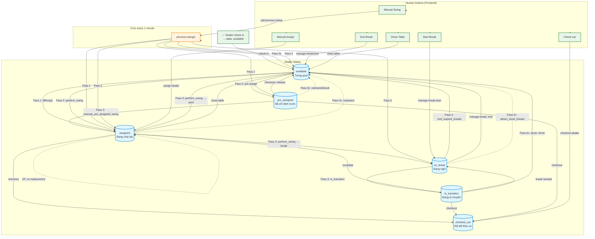

# Dealer Swing System — Full Compilation

> **File tổng hợp toàn bộ code + logic vận hành của hệ thống Dealer Swing**
> Ngày tạo: 2026-07-13

---

## Mục lục

1. [Tổng quan kiến trúc](#1-t%E1%BB%95ng-quan-ki%E1%BA%BFn-tr%C3%BAc)
2. [Dealer State Machine](#2-dealer-state-machine)
3. [Cron Job Flow (process-swing)](#3-cron-job-flow-process-swing)
4. [Edge Functions](#4-edge-functions)
5. [Shared Utilities](#5-shared-utilities)
6. [Frontend (DealerSwingTab.tsx)](#6-frontend-dealerswingtabtsx)
7. [Database Schema & Migrations](#7-database-schema--migrations)

---

## 1. Tổng quan kiến trúc

```mermaid
graph TB
    subgraph "Cron (every 1 min)"
        CRON[Cloud Scheduler<br/>Đến giờ swing?]
        PS[process-swing/index.ts<br/>1271 dòng]
    end

    subgraph "Edge Functions"
        CK[checkout-dealer<br/>275 dòng]
        MB[manage-break<br/>220 dòng]
        CT[close-table<br/>198 dòng]
        AD[assign-dealer]
        EBB[enforceBreakBalance]
    end

    subgraph "Database (Supabase PG)"
        RPC_transition["transition_dealer_state()<br/>State RPC (validation + audit)"]
        RPC_perform["perform_swing()<br/>Atomic swing RPC"]
        RPC_preassign["execute_pre_assigned_swing()<br/>Pre-assigned swing RPC"]
        RPC_assign["assign_dealer_to_table()<br/>Fill empty table RPC"]
        DB_dealer_attendance[dealer_attendance]
        DB_dealer_assignments[dealer_assignments]
        DB_triggers["state_change trigger<br/>→ dealer_state_transitions audit"]
    end

    subgraph "Shared Utils (_shared/)"
        PND[pickNextDealer.ts<br/>424 dòng]
        FET[fillEmptyTables.ts<br/>194 dòng]
        EBN[evaluateBreakNeed.ts<br/>141 dòng]
        CSD[computeSwingDuration.ts<br/>112 dòng]
        TG[telegram.ts + telegramNotifier.ts]
    end

    subgraph "Frontend"
        DST[DealerSwingTab.tsx<br/>3378 dòng]
        Hooks[useDealerSwing hooks]
    end

    CRON -->|HTTP invoke| PS
    PS --> PND
    PS --> FET
    PS --> EBN
    PS --> CSD
    PS --> TG
    PS -->|Pass 0-4| RPC_transition
    PS -->|Pass 3 swing| RPC_perform
    PS -->|Pre-assigned swing| RPC_preassign
    PS -->|Pass 1 fill| RPC_assign

    CK --> RPC_transition
    MB --> RPC_transition
    CT --> RPC_transition
    AD --> RPC_transition
    EBB --> RPC_transition

    RPC_transition --> DB_dealer_attendance
    RPC_perform --> DB_dealer_attendance
    RPC_perform --> DB_dealer_assignments
    RPC_preassign --> DB_dealer_attendance
    RPC_preassign --> DB_dealer_assignments
    RPC_assign --> DB_dealer_assignments

    DST -->|supabase client| DB_dealer_attendance
    DST -->|supabase client| DB_dealer_assignments
    DST -->|invoke| CK
    DST -->|invoke| MB
```



---

## 2. Dealer State Machine

### State Transition Matrix

```
┌────────────────┬─────────────────────────────────────────────────────────────────────┐
│ FROM \ TO      │ available  pre_assigned  assigned  in_transition  on_break  checked_out │
├────────────────┼─────────────────────────────────────────────────────────────────────┤
│ available      │     -           ✓            ✓           ✓            ✓          ✓    │
│ pre_assigned   │     ✓           -            ✓           -            -          ✓    │
│ assigned       │     ✓           -            -           ✓            ✓          ✓    │
│ in_transition  │     ✓           -            ✓           -            ✓          ✓    │
│ on_break       │     ✓           -            -           ✓            -          ✓    │
│ swing_ready    │     ✓           -            -           ✓            -          ✓    │
└────────────────┴─────────────────────────────────────────────────────────────────────┘
```

### State Meanings

| State | Ý nghĩa |
|-------|---------|
| `available` | Dealer rảnh, trong pool chờ được gán |
| `pre_assigned` | Đã được chỉ định trước cho 1 bàn (swing sắp tới) |
| `assigned` | Đang chia bài tại 1 bàn |
| `in_transition` | Đang di chuyển giữa các bàn |
| `on_break` | Đang nghỉ giải lao |
| `swing_ready` | Sẵn sàng swing (cho sync mode) |
| `checked_out` | Đã kết thúc ca |

### transition_dealer_state() RPC (PL/pgSQL)

```sql
-- ════════════════════════════════════════════════════════════════════
-- transition_dealer_state()
-- RF1: Validates state transitions
-- RF2: Row-level lock (FOR UPDATE) prevents race conditions
-- RF3: Sets app.state_reason for trigger audit
-- RF4: Auto-resets worked_minutes_since_last_break = 0
--      when entering on_break / available / checked_out
-- RF5: Returns JSONB { ok, from, to, noop?, error? }
-- ════════════════════════════════════════════════════════════════════

CREATE OR REPLACE FUNCTION public.transition_dealer_state(
  p_attendance_id UUID,
  p_new_state     TEXT,
  p_reason        TEXT DEFAULT NULL
)
RETURNS JSONB
LANGUAGE plpgsql
SECURITY DEFINER
SET search_path = public
AS $$
DECLARE
  v_old_state TEXT;
  v_valid     BOOLEAN;
BEGIN
  -- Lock row
  SELECT current_state INTO v_old_state
  FROM dealer_attendance
  WHERE id = p_attendance_id
  FOR UPDATE;

  IF NOT FOUND THEN
    RETURN jsonb_build_object('ok', false, 'error', 'ATTENDANCE_NOT_FOUND');
  END IF;

  -- Same state → idempotent no-op
  IF v_old_state = p_new_state THEN
    RETURN jsonb_build_object(
      'ok', true, 'from', v_old_state, 'to', p_new_state, 'noop', true
    );
  END IF;

  -- Validate transition
  v_valid := CASE
    WHEN v_old_state = 'available'     AND p_new_state IN ('pre_assigned','assigned','in_transition','on_break','checked_out') THEN true
    WHEN v_old_state = 'pre_assigned'  AND p_new_state IN ('assigned','available','checked_out')                              THEN true
    WHEN v_old_state = 'assigned'      AND p_new_state IN ('on_break','in_transition','available','checked_out')              THEN true
    WHEN v_old_state = 'in_transition' AND p_new_state IN ('assigned','available','on_break','checked_out')                   THEN true
    WHEN v_old_state = 'on_break'      AND p_new_state IN ('available','in_transition','checked_out')                         THEN true
    WHEN v_old_state = 'swing_ready'   AND p_new_state IN ('in_transition','available','checked_out')                         THEN true
    ELSE false
  END;

  IF NOT v_valid THEN
    RETURN jsonb_build_object(
      'ok', false,
      'error', 'INVALID_TRANSITION',
      'from', v_old_state,
      'to', p_new_state
    );
  END IF;

  -- Set session variable for trigger
  PERFORM set_config(
    'app.state_reason',
    COALESCE(p_reason, 'transition_dealer_state'),
    true
  );

  -- Execute transition + reset worked_minutes when entering non-working states
  UPDATE dealer_attendance
  SET
    current_state = p_new_state,
    worked_minutes_since_last_break = CASE
      WHEN p_new_state IN ('on_break', 'available', 'checked_out') THEN 0
      ELSE worked_minutes_since_last_break
    END
  WHERE id = p_attendance_id;

  RETURN jsonb_build_object('ok', true, 'from', v_old_state, 'to', p_new_state);
END;
$$;
```

### Edge Function → RPC Usage (ALL callers)

| File | RPC Call | Transition |
|------|----------|-----------|
| `process-swing/pass2-pre-assign.ts` | `transition_dealer_state(attId, 'pre_assigned', 'pass2_pre_assign')` | available → pre_assigned |
| `checkout-dealer/index.ts:66` | `transition_dealer_state(attId, 'available', 'checkout_release_pre_assign')` | pre_assigned → available |
| `checkout-dealer/index.ts:131` | `transition_dealer_state(attId, 'checked_out', 'dealer_checkout')` | * → checked_out |
| `manage-break/index.ts:89` | `transition_dealer_state(attId, 'on_break', 'manage_break_start')` | assigned → on_break |
| `enforceBreakBalance/index.ts:254` | `transition_dealer_state(attId, 'on_break', ...)` | assigned → on_break |
| `close-table/index.ts:125` | `transition_dealer_state(attId, 'available', ...)` | assigned → available |
| `process-swing Pass 0c` | `transition_dealer_state(attId, 'available', 'pass0c_*')` | stuck → available |
| `process-swing Pass 1b` | `transition_dealer_state(attId, 'available', 'pass1b_*')` | pre_assigned → available |
| `process-swing Pass 1c` | `transition_dealer_state(attId, 'available', 'pass1c_*')` | pre_assigned → available |
| `process-swing safeguard` | `transition_dealer_state(att, 'available', 'safeguard_*')` | * → available |

---

## 3. Cron Job Flow (process-swing)

### Entry Point

**File**: `supabase/functions/process-swing/index.ts` (1271 dòng)

Triggered by Cloud Scheduler (every 1 minute). Accepts:

```json
{
  "club_id": "optional-single-club",
  "shift_id": "optional-shift-scope",
  "force_all": false,
  "dry_run": false,
  "manual_trigger": false,
  "required_game_types": ["holdem", "omaha"]
}
```

### Pass System Flow

```mermaid
sequenceDiagram
    participant Cron
    participant PS as process-swing
    participant DB as Supabase DB
    participant TG as Telegram

    Cron->>PS: HTTP invoke (every 1 min)

    PS->>PS: Fetch all club configs (swing_config)
    PS->>PS: Filter clubs with auto_swing_enabled
    PS->>PS: Initialize TelegramNotifier per club

    rect rgb(220, 230, 241)
        Note over PS: PASS 0 — Pre-compute
        PS->>DB: get_dealer_pool_snapshot()
        PS->>PS: calculateBatchSwingDuration()
        PS->>DB: Count available dealers (break deadlock guard)
    end

    rect rgb(200, 220, 240)
        Note over PS: PASS 0c — Stuck Dealer Recovery
        PS->>DB: Find stuck pre_assigned (missing table_id/timestamp)
        PS->>DB: transition_dealer_state → available
        PS->>DB: Find orphaned pre_assigned (no active assignment)
        PS->>DB: transition_dealer_state → available
        PS->>DB: detect_stuck_breaks() → end_dealer_break()
        PS->>DB: Find stuck in_transition (>5min) → available
        PS->>DB: Find orphaned assigned (table closed, no assignment)
        PS->>DB: transition_dealer_state → available
        PS->>TG: Alert if any stuck dealers found
    end

    rect rgb(230, 240, 230)
        Note over PS: PASS 1 — Fill Empty Tables
        PS->>DB: Find tables with NO dealer assignment
        PS->>DB: pickNextDealer() + assign_dealer_to_table() RPC
        Note over PS: 3 attempts per table (CAS conflict retry)
        PS->>TG: SwingIn notification
    end

    rect rgb(255, 255, 230)
        Note over PS: PASS 1b — Stale Pre-assign Cleanup
        PS->>DB: Find pre_assign >20min stale + past swing_due_at
        PS->>DB: transition_dealer_state → available
    end

    rect rgb(255, 245, 230)
        Note over PS: PASS 1c — Orphaned Pre-assign Release
        PS->>DB: Find pre_assigned with NULL table_id
        PS->>DB: transition_dealer_state → available
    end

    rect rgb(240, 235, 255)
        Note over PS: PASS 2 — Pre-assign Incoming
        PS->>DB: Find assignments in pre-announce window [T+4min, T+8min]
        PS->>DB: pickNextDealer() → pre-assign CAS RPC
        PS->>TG: PreAssign notification
    end

    rect rgb(235, 245, 245)
        Note over PS: PASS 2.5 — Initial Assign
        PS->>DB: Fix assignments with status='assigned' but NULL dealer_id
        PS->>DB: pickNextDealer() → assign
    end

    rect rgb(255, 240, 240)
        Note over PS: PASS 3 — Execute Swings (T-0)
        PS->>DB: Query swings WHERE swing_due_at <= now+2min
        Note over PS: SORT: OT dealers first > oldest swing_due_at
        Note over PS: LIMIT 8 per cycle (cron budget ~50s)

        alt Pre-assigned Path
            PS->>DB: execute_pre_assigned_swing() RPC
            alt Success
                PS->>TG: SwingIn + BreakStart
            else Race Lost
                PS->>PS: Fallback: pickNextDealer() + perform_swing()
                alt Fallback fails
                    PS->>PS: OT escalation path
                end
            end
        else Non-pre-assigned Path (pick from pool)
            Note over PS: Level 1: Normal pick (all filters active)
            PS->>DB: pickNextDealer() + perform_swing()
            alt Level 1 fails + OT table
                Note over PS: Level 2: Relax priority_break_flag guard
                PS->>DB: pickNextDealer(skipPriorityBreakGuard:true)
            end
            alt Level 2 fails + OT >20min
                Note over PS: Level 3: Relax fatigue hard cap
                PS->>DB: pickNextDealer(skipFatigueHardCap:true, skipPriorityBreakGuard:true)
            end
            alt No dealer at all
                PS->>DB: perform_swing(send_to_break:false) → OT start
                PS->>TG: OT alert (with 5min throttle)
            end
        end
    end

    rect rgb(240, 255, 240)
        Note over PS: PASS 4 — End Expired Breaks
        PS->>DB: end_expired_breaks() → SET current_state='available'
    end

    rect rgb(240, 240, 255)
        Note over PS: PASS 4b — Pool Summary Refresh
        PS->>DB: refresh_dealer_pool_summary()
    end

    PS->>PS: Shortage escalation check (>50% no_dealer, >=3 tables)
    PS->>PS: All-tables-OT check → Telegram alert
    PS->>TG: notifier.flush()
    PS->>DB: upsert swing_metrics
    PS-->>Cron: Response { ok, processing_ms, metrics }
```



### Perform Swing RPC (atomic swing execution)

```sql
-- ════════════════════════════════════════════════════════════════════
-- perform_swing()
-- Atomic swing operation: ends old assignment, transitions old dealer,
-- creates new assignment, transitions new dealer
-- ════════════════════════════════════════════════════════════════════

CREATE OR REPLACE FUNCTION public.perform_swing(
  p_assignment_id       UUID,
  p_duration_minutes    INT DEFAULT 30,
  p_send_to_break       BOOLEAN DEFAULT FALSE,
  p_compensatory_minutes INT DEFAULT 0,
  p_enforce_next_swing  INT DEFAULT 75,
  p_minimum_worked      INT DEFAULT 15
)
RETURNS JSONB
LANGUAGE plpgsql
SECURITY DEFINER
SET search_path = public
AS $$
DECLARE
  v_assignment RECORD;
  v_table_id UUID;
  v_club_id UUID;
  v_shift_id UUID;
  v_old_attendance_id UUID;
  v_old_dealer_id UUID;
  v_next_dealer_id UUID;
  v_next_attendance_id UUID;
  v_next_dealer_was_pre_assigned BOOLEAN;
  v_actual_minutes INT;
  v_ot_minutes INT;
  v_comp_break INT;
  v_outcome TEXT;
  v_message TEXT;
  v_old_state TEXT;
  v_new_assignment_id UUID;
  v_actual_version INT;
  v_was_priority_break BOOLEAN;
  v_old_started_at TIMESTAMPTZ;
  v_swing_due_at TIMESTAMPTZ;
BEGIN
  -- STEP 1: LOCK & LOAD assignment (FOR UPDATE OF a)
  SELECT a.id, a.table_id, a.dealer_id, a.attendance_id, a.started_at,
         a.version, a.expected_duration_minutes,
         t.club_id, t.id AS tbl_id, t.shift_id,
         a.pre_assigned_attendance_id
  INTO v_assignment
  FROM dealer_assignments a
  JOIN game_tables t ON t.id = a.table_id
  WHERE a.id = p_assignment_id
  FOR UPDATE OF a;

  IF NOT FOUND THEN
    RETURN jsonb_build_object('outcome', 'error', 'message', 'Assignment not found');
  END IF;

  -- STEP 2: Validate current_state = 'assigned'
  IF v_old_state IS DISTINCT FROM 'assigned' THEN
    RETURN jsonb_build_object('outcome', 'state_mismatch', ...);
  END IF;

  -- STEP 3: Compute actual & OT minutes
  v_actual_minutes := GREATEST(0, EXTRACT(EPOCH FROM NOW() - v_old_started_at) / 60)::INT;
  v_ot_minutes     := GREATEST(0, v_actual_minutes - COALESCE(p_duration_minutes, 30));
  v_comp_break     := GREATEST(0, COALESCE(p_compensatory_minutes, v_ot_minutes));

  -- STEP 4: Pick next dealer
  --   Try pre-assigned first → if not found, fallback to pool (available, least worked)
  --   Enforce next-swing threshold if next dealer >= 75min
  --   If no dealer → SET back to assigned (stay at table)

  -- STEP 5: End old assignment (status='completed', ended_at=NOW)

  -- STEP 6: Update old dealer state
  IF p_send_to_break THEN
    -- → on_break, worked_minutes_since_last_break = 0
    -- → insert dealer_breaks record
  ELSE
    -- → available, worked_minutes_since_last_break = 0
  END IF;
  -- Accumulate OT

  -- STEP 7: Create new assignment (gen_random_uuid())
  -- STEP 8: Update new dealer state → assigned
  -- STEP 9: Clear pre-assignment link

  RETURN jsonb_build_object(
    'outcome', v_outcome,
    'message', v_message,
    'new_assignment_id', v_new_assignment_id,
    'overtime_minutes', v_ot_minutes,
    ...
  );
END;
$$;
```

---

## 4. Edge Functions

### 4.1 checkout-dealer/index.ts (275 dòng)

Xử lý checkout dealer với các bước:

```
1. Verify auth + dealer_control permission
2. If current_state == 'pre_assigned' → release pre_assign (transition → available)
3. Compute overtime: worked = checkin→now minus break time, OT = max(0, worked - 480)
4. Transition state → checked_out (via RPC, validated + audited)
5. Update non-state fields: check_out_time, overtime_minutes, worked_minutes, pre_assigned=null
6. Telegram notification: group chat + floor manager (if was pre_assigned)
7. Audit log insert
```

### 4.2 manage-break/index.ts (220 dòng)

Xử lý 3 actions:

| Action | Process |
|--------|---------|
| `start` | CAS update assignment→on_break, insert dealer_breaks, transition state→on_break, return immediately before Telegram |
| `end` / `return_from_break` | `complete_dealer_break()` RPC (atomic) |
| `tournament_break` | `tournament_break_all_tables()` RPC — set all assigned dealers→on_break, Telegram DM từng dealer |

**Key pattern**: Critical path returns before Telegram side-effect (withTimeout 5s).

### 4.3 close-table/index.ts (198 dòng)

```
1. Verify table status='active'
2. Check dealer_control permission
3. Find active assignment + dealer → transition to 'available'
4. Update game_tables.status='inactive'
5. Update dealer_attendance: current_table_id=NULL, pre_assigned=NULL
6. Send Telegram (announce table closed)
```

### 4.4 assign-dealer/index.ts

Gán dealer vào bàn không có dealer:
```
1. Receive table_id + dealer_id (or auto-pick from attendance_id)
2. Call transition_dealer_state(attId, 'assigned', ...)
3. Create dealer_assignments record
4. Update game_tables.current_dealer
```

### 4.5 enforceBreakBalance/index.ts

Kiểm tra định kỳ nếu dealer nào làm việc quá 60 phút liên tục thì:

```
1. Query: assigned + worked_minutes >= minWork AND no break scheduled
2. Call transition_dealer_state → on_break
3. Create dealer_breaks record
4. If shift has break balance → also notify available dealers to go to break
```

---

## 5. Shared Utilities

### 5.1 pickNextDealer.ts (424 dòng)

Core algorithm chọn dealer tiếp theo từ pool.

**Scoring system**:

```
score = rest_bonus + tier_bonus + skill_bonus
      + mixed_bonus + priority_swing_bonus
      - back_to_back_penalty
      - consecutive_penalty
      - priority_break_penalty (-500)
      - heavy_worker_penalty
      - break_equity_penalty
      - tier_back_to_back_penalty
      - consecutive_high_penalty
      - fatigue_penalty
```

**Hard filters**:
- `current_state = 'available'`
- `status = 'checked_in'`
- Not in `excludeAttendanceIds`
- Not on same table back-to-back (unless only option)
- `worked_minutes_since_last_break < 105` (fatigue cap, unless `skipFatigueHardCap`)
- `priority_break_flag = false` (unless `skipPriorityBreakGuard`)

**Game type matching**: Checks dealer skills array matches `requiredGameTypes`.

**Tier matching**: HIGH tables → A-tier dealers preferred +30; MEDIUM → B-tier preferred.

### 5.2 fillEmptyTables.ts (194 dòng)

Auto-fill bàn không có dealer:

```
1. Find active tables WITHOUT active assignment
2. Sort by blind level descending (highest priority first)
3. For each table: 3 attempts pickNextDealer + assign_dealer_to_table RPC
4. Stagger swing_due_at: (index % 10) * 30s deterministic delay
```

### 5.3 evaluateBreakNeed.ts (141 dòng)

5-rule break decision tree:

| Rule | Condition | Priority |
|------|-----------|----------|
| **1. Mandatory** | `workedMinutes >= maxWork` (120) | 🔴 Cao nhất |
| **2. Priority flag** | `priority_break_flag` AND `worked >= minWork` (60) | 🟠 Cao |
| **3. Balance (equity)** | Dealer's break ratio < 80% club avg AND `worked >= minWork` | 🟡 Trung bình |
| **4. Deadlock guard** | Pool empty AND `worked >= minWork * 1.5` AND OT >= 10min | 🔵 Thấp |
| **5. None** | Mặc định | ⚪ |

### 5.4 computeSwingDuration.ts (112 dòng)

Dynamic swing duration:

```
ratio = weighted_pool / active_tables
factor = CLAMP(target_ratio / ratio, base/max, base/min)
duration = CLAMP(base / factor, min, max)
```

- **Tight pool** (ratio < target): factor > 1 → shorter swings (xoay nhanh hơn)
- **Generous pool** (ratio > target): factor < 1 → longer swings

### 5.5 calculateBatchSwingDuration.ts (150 dòng)

Pre-compute ONE duration for a batch (TOCTOU-safe). Fixes per-row trigger anti-pattern where pool shrinks mid-batch.

### 5.6 telegram.ts + telegramNotifier.ts

Telegram notification system:

| Notification | Type | When |
|-------------|------|------|
| Dealer sắp vào bàn | `swing_in` | Swing execution |
| Bắt đầu break | `break_start` | Dealer được swing sang break |
| Pre-assign | `pre_assign` | Dealer được pre-assign |
| OT cảnh báo | `ot_alert` | No dealer available |
| Thiếu dealer | `shortage` | >50% no-dealer |
| Toàn bộ bàn OT | `all_ot` | 100% active tables OT |
| Check-out đột xuất | `checkout_alert` | Pre-assigned dealer check-out |

**TelegramNotifier**: Batching class — enqueue events, flush in one request.

---

## 6. Frontend — DealerSwingTab.tsx

### File Structure

**Path**: `src/components/cashier/DealerSwingTab.tsx` (3378 dòng)

### Key Sections (by line number)

| Lines | Section | Description |
|-------|---------|-------------|
| 1-55 | Imports | shadcn/ui, hooks, react-query |
| 60-75 | `useTours` hook | Fetches dealer_shifts |
| 80-120 | `SwingPanel` state | 30+ state variables, all queries |
| 127-197 | UI state | processing, modals, dialogs |
| 199-250 | Auto-swing setup | Fetches auto_swing_enabled setting |
| 250-400 | Roster view | Dealer list with scores, tiers |
| 400-600 | Tables view | Table grid with timers, state badges |
| 600-900 | Dealers view | Per-dealer details |
| 900-1200 | Modal: Manual swing | Swing control per table |
| 1200-1500 | Modal: Check-in dialog | Check-in management |
| 1500-1800 | Modal: Check-out | Single/batch checkout |
| 1800-2100 | Modal: Create table | Pool-based table creation |
| 2100-2400 | Break policies | Shift break policy management |
| 2400-2700 | Payroll | Tính lương, OT, export |
| 2700-3000 | Swing config | Club swing config editor |
| 3000-3378 | Export, Telegram config | Utility features |

### Key Hooks

```
useCheckedInDealers          — Dealers checked in
useActiveTables              — Tables active (game_tables.status='active')
useActiveAssignmentsWithTimeline — Assignments + swing_due_at timeline
useSwingConfigs              — Swing configs per club/table_type
useAvailableTables           — Tables available for assignment
usePreAssignedDealers        — Pre-assigned map
usePoolTables                — Tables needing dealers
useNextDealerPredictions     — Predicted next dealer per table
useSwingMetrics              — Swing success/fail metrics
```

### PriorityBreakIndicator (badge fix)

```tsx
// DealerSwingTab.tsx ~line 2197
// ONLY renders for working dealers (not on break)
{sec.key !== "Đang nghỉ" && <PriorityBreakIndicator ... />}
```

### Swing Control

```tsx
// Manual swing trigger
const handleSwing = async (tableId: string) => {
  setProcessing(tableId);
  const { data } = await supabase.functions.invoke("process-swing", {
    body: { club_id: selectedClubId, manual_trigger: true }
  });
  // ...
};
```

---

## 7. Database Schema & Migrations

### Dealer Attendance

```sql
CREATE TABLE dealer_attendance (
  id                          UUID PRIMARY KEY DEFAULT gen_random_uuid(),
  dealer_id                   UUID NOT NULL REFERENCES dealers(id),
  club_id                     UUID NOT NULL REFERENCES clubs(id),
  shift_id                    UUID REFERENCES dealer_shifts(id),
  status                      TEXT NOT NULL DEFAULT 'deleted',       -- checked_in | checked_out
  current_state               TEXT NOT NULL DEFAULT 'available',    -- state machine
  check_in_time               TIMESTAMPTZ,
  check_out_time              TIMESTAMPTZ,
  
  -- Fields
  current_table_id            UUID REFERENCES game_tables(id),
  pre_assigned_table_id       UUID REFERENCES game_tables(id),
  pre_assigned_at             TIMESTAMPTZ,
  
  -- Metrics
  worked_minutes_since_last_break INT DEFAULT 0,
  overtime_minutes            INT DEFAULT 0,
  break_count                 INT DEFAULT 0,
  priority_break_flag         BOOLEAN DEFAULT false,
  
  -- State tracking
  version                     INT DEFAULT 1,
  updated_at                  TIMESTAMPTZ DEFAULT NOW()
);
```

### Dealer Assignments

```sql
CREATE TABLE dealer_assignments (
  id                          UUID PRIMARY KEY DEFAULT gen_random_uuid(),
  club_id                     UUID NOT NULL REFERENCES clubs(id),
  shift_id                    UUID REFERENCES dealer_shifts(id),
  table_id                    UUID NOT NULL REFERENCES game_tables(id),
  dealer_id                   UUID REFERENCES dealers(id),
  attendance_id               UUID REFERENCES dealer_attendance(id),
  
  status                      TEXT NOT NULL DEFAULT 'assigned',   -- assigned | completed
  version                     INT DEFAULT 1,
  
  -- Timing
  started_at                  TIMESTAMPTZ DEFAULT NOW(),
  ended_at                    TIMESTAMPTZ,
  swing_due_at                TIMESTAMPTZ,
  swing_processed_at          TIMESTAMPTZ,
  
  -- Pre-assignment
  pre_assigned_attendance_id  UUID REFERENCES dealer_attendance(id),
  pre_assigned_at             TIMESTAMPTZ,
  released_at                 TIMESTAMPTZ,
  
  -- OT tracking
  overtime_started_at         TIMESTAMPTZ,
  last_ot_alert_at            TIMESTAMPTZ,
  
  -- Duration
  expected_duration_minutes   INT,
  actual_duration_minutes     INT,
  overtime_minutes            INT
);
```

### Key Migrations

| Migration | Purpose |
|-----------|---------|
| `20260601000001_phase2_break_duration` | Phase 2 break duration setup |
| `20260613000005` | Swing duration improvements |
| `20260704000004_perform_swing_with_context` | Context-aware perform_swing |
| `20260712000001_add_state_transitions` | State transition validation matrix |
| `20260713000001_reset_worked_minutes_non_working_states` | **NEW**: Reset worked_minutes=0 when entering non-working states |

### Dealer State Transitions Audit

Trigger on `dealer_attendance.current_state` change → writes to `dealer_state_transitions`:

```sql
CREATE TABLE dealer_state_transitions (
  id              UUID PRIMARY KEY DEFAULT gen_random_uuid(),
  attendance_id   UUID NOT NULL,
  from_state      TEXT,
  to_state        TEXT,
  reason          TEXT,
  changed_by      TEXT DEFAULT 'system',
  created_at      TIMESTAMPTZ DEFAULT NOW()
);
```

---

## 8. Operational Flow Summary



---

## Appendix: File Index

| # | File | Lines | Vai trò |
|---|------|-------|---------|
| 1 | `supabase/functions/process-swing/index.ts` | 1271 | Cron job: swing orchestration (Pass 0-4b) |
| 2 | `supabase/functions/process-swing/passes/pass2-pre-assign.ts` | 210 | Pass 2: pre-assign incoming dealers |
| 3 | `supabase/functions/process-swing/passes/pass2.5-initial-assign.ts` | — | Pass 2.5: fix NULL dealer_id assignments |
| 4 | `supabase/functions/process-swing/calculateBatchSwingDuration.ts` | 150 | Batch swing duration calculator |
| 5 | `supabase/functions/checkout-dealer/index.ts` | 275 | Dealer checkout |
| 6 | `supabase/functions/manage-break/index.ts` | 220 | Break management (start/end/tournament) |
| 7 | `supabase/functions/close-table/index.ts` | 198 | Close table + release dealer |
| 8 | `supabase/functions/assign-dealer/index.ts` | — | Manual dealer assignment |
| 9 | `supabase/functions/enforceBreakBalance/index.ts` | — | Enforce break equity |
| 10 | `supabase/functions/_shared/pickNextDealer.ts` | 424 | Dealer selection algorithm |
| 11 | `supabase/functions/_shared/fillEmptyTables.ts` | 194 | Auto-fill empty tables |
| 12 | `supabase/functions/_shared/evaluateBreakNeed.ts` | 141 | Break decision engine |
| 13 | `supabase/functions/_shared/computeSwingDuration.ts` | 112 | Dynamic swing duration |
| 14 | `supabase/functions/_shared/dealer-utils.ts` | 87 | Re-export hub + corsHeaders |
| 15 | `supabase/functions/_shared/telegram.ts` | — | Telegram send + format helpers |
| 16 | `supabase/functions/_shared/telegramNotifier.ts` | — | Batch notification queue |
| 17 | `supabase/functions/_shared/retry.ts` | — | Retry helper |
| 18 | `src/components/cashier/DealerSwingTab.tsx` | 3378 | Frontend swing dashboard |
| 19 | `src/components/cashier/DealerManagementTab.tsx` | — | Dealer CRUD management |
| 20 | `src/components/cashier/NextDealerPreview.tsx` | — | Next dealer prediction display |
| 21 | `src/components/cashier/AddDealerDialog.tsx` | — | Add dealer form |
| 22 | `src/components/cashier/DealerRow.tsx` | — | Dealer row component |
| 23 | `src/hooks/useDealerSwing.ts` | — | All React Query hooks |
| 24 | `supabase/migrations/20260712000001_add_state_transitions.sql` | 95 | State transition matrix |
| 25 | `supabase/migrations/20260713000001_reset_worked_minutes_non_working_states.sql` | 460 | **NEW**: worked_minutes reset fix |

---

*Generated 2026-07-13 — Sisyphus*
