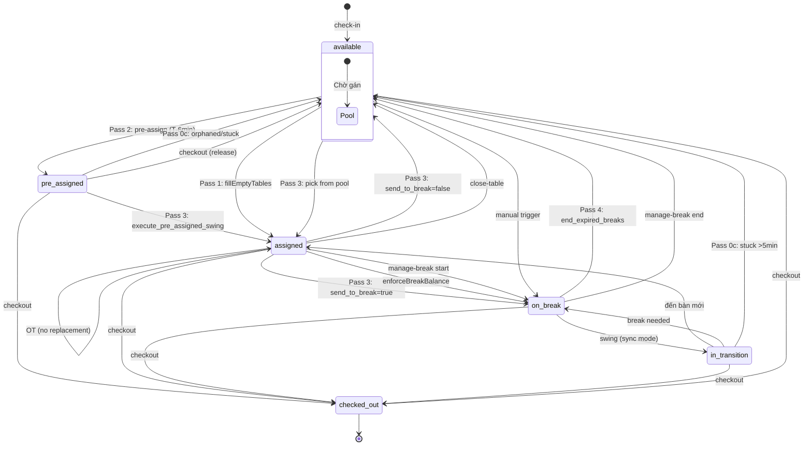
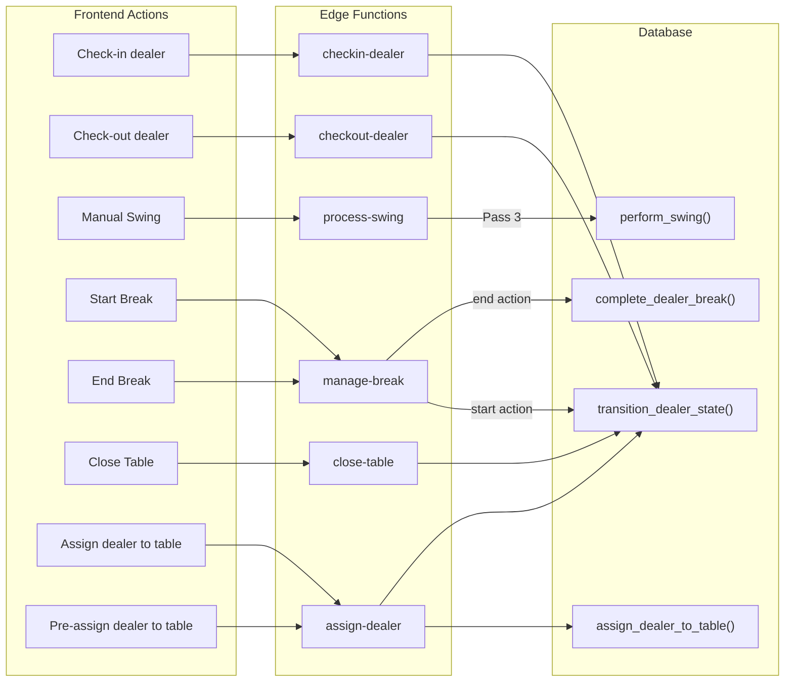
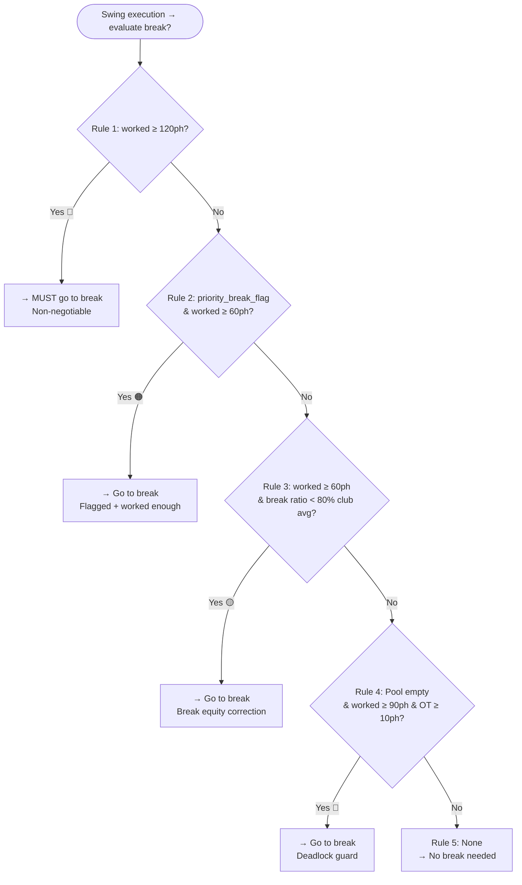
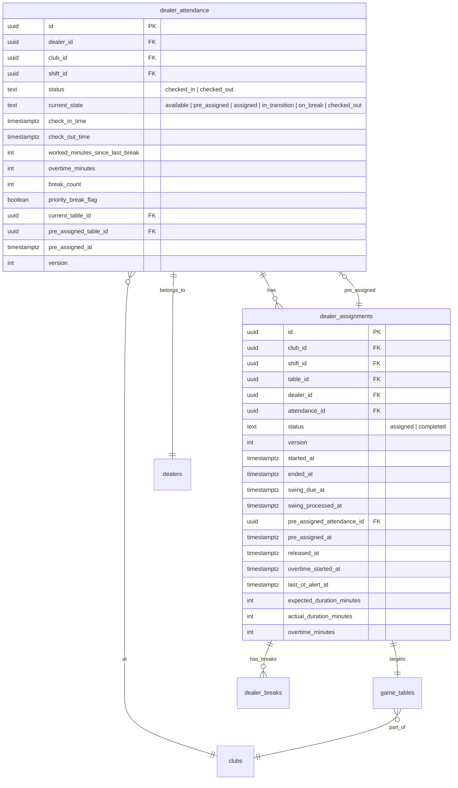

# Qui trình vận hành Dealer Swing

## State Machine

## Swing Process (Cron every 1 minute)

```mermaid
flowchart TB
    START([Cron: 1 phút]) --> PASS0
    
    subgraph PASS0 ["Pass 0 — Chuẩn bị"]
        P0A["Fetch club configs<br/>(swing_config)"]
        P0B["Pool snapshot<br/>(get_dealer_pool_snapshot)"]
        P0C["Batch duration calc<br/>(calculateBatchSwingDuration)"]
        P0D["Đếm available dealers<br/>(break deadlock guard)"]
        P0A --> P0B --> P0C --> P0D
    end
    
    PASS0 --> PASS0C
    
    subgraph PASS0C ["Pass 0c — Stuck Dealer Recovery"]
        direction TB
        P0C1["Stuck pre_assigned<br/>(missing table_id/timestamp)"]
        P0C2["Orphaned pre_assigned<br/>(no active assignment)"]
        P0C3["Stuck breaks > hạn<br/>(detect_stuck_breaks)"]
        P0C4["Stuck in_transition >5ph<br/>(chưa đến bàn)"]
        P0C5["Orphaned assigned<br/>(table closed, no assignment)"]
        
        P0C1 -->|release| AVAIL1["→ available"]
        P0C2 -->|release| AVAIL2["→ available"]
        P0C3 -->|end_dealer_break| AVAIL3["→ available"]
        P0C4 -->|release| AVAIL4["→ available"]
        P0C5 -->|release| AVAIL5["→ available"]
    end
    
    PASS0C --> PASS1
    
    subgraph PASS1 ["Pass 1 — Fill Empty Tables"]
        P1A["Tìm bàn KHÔNG có dealer"]
        P1B["Sắp xếp: blind level cao nhất trước"]
        P1C["pickNextDealer() +<br/>assign_dealer_to_table() RPC"]
        P1D["3 lần thử CAS conflict retry"]
        P1A --> P1B --> P1C --> P1D
    end
    
    PASS1 --> PASS1B
    
    PASS1B["Pass 1b — Xoá pre_assign cũ >20ph"]

    PASS1B --> PASS1C

    PASS1C["Pass 1c — Xoá pre_assign mồ côi<br/>(NULL table_id)"]

    PASS1C --> PASS2
    
    subgraph PASS2 ["Pass 2 — Pre-assign"]
        P2A["Tìm assignment trong window<br/>swing_due_at = T+4ph → T+8ph"]
        P2B["pickNextDealer() +<br/>pre-assign CAS RPC"]
        P2A --> P2B
    end
    
    PASS2 --> PASS25
    
    PASS25["Pass 2.5 — Fix assignments<br/>có status='assigned' nhưng NULL dealer_id"]

    PASS25 --> PASS3
    
    subgraph PASS3 ["Pass 3 — Execute Swings (T-0)"]
        direction TB
        P3A["Query swings WHERE<br/>swing_due_at ≤ now+2ph"]
        P3B["SORT: OT dealers first<br/>→ oldest swing_due_at"]
        P3C["LIMIT 8 per cycle"]
        
        P3A --> P3B --> P3C
        
        P3C --> P3_CHECK{"Pre-assigned?"}
        
        P3_CHECK -->|"Có"| P3_PRE["execute_pre_assigned_swing()"]
        P3_PRE --> P3_PRE_RES{"Kết quả?"}
        P3_PRE_RES -->|success| P3_DONE["✅ Swing thành công"]
        P3_PRE_RES -->|race_lost| P3_FALLBACK["Fallback: pickNextDealer<br/>+ perform_swing()"]
        
        P3_CHECK -->|"Không"| P3_PICK["pickNextDealer()"]
        P3_PICK --> P3_FOUND{"Có dealer?"}
        P3_FOUND -->|"Có"| P3_SWING["perform_swing()"]
        P3_SWING --> P3_SWING_RES{"send_to_break?"}
        P3_SWING_RES -->|true| P3_BREAK["Dealer cũ → on_break<br/>+ insert dealer_breaks"]
        P3_SWING_RES -->|false| P3_POOL["Dealer cũ → available"]
        
        P3_FOUND -->|"Không"| P3_OT["perform_swing(send_to_break=false)<br/>→ dealer ở lại → OT"]
        P3_OT --> P3_OT_ALERT["OT alert Telegram<br/>(5ph throttle)"]
        
        P3_FALLBACK --> P3_FRESH{"Fresh row<br/>already completed?"}
        P3_FRESH -->|"Yes"| P3_DONE
        P3_FRESH -->|"No"| P3_FB_PICK["pickNextDealer fallback"]
        P3_FB_PICK --> P3_FB_FOUND{"Có dealer?"}
        P3_FB_FOUND -->|"Yes"| P3_FB_SWING["perform_swing()"]
        P3_FB_FOUND -->|"No"| P3_OT
    end
    
    PASS3 --> PASS4
    
    PASS4["Pass 4 — End expired breaks<br/>end_expired_breaks() → available"]

    PASS4 --> PASS4B
    
    PASS4B["Pass 4b — Refresh dealer pool summary"]

    PASS4B --> SHORTAGE
    
    SHORTAGE{"Shortage check<br/>>50% no_dealer<br/>& >=3 tables?"}
    SHORTAGE -->|"Có"| AUTO_CLOSE{"Auto-close enabled<br/>& >= threshold?"}
    SHORTAGE -->|"Không"| ALL_OT
    
    AUTO_CLOSE -->|"Có"| CLOSE["auto_close_low_priority_tables()"]
    AUTO_CLOSE -->|"Không"| ESCALATE["Telegram alert: thiếu dealer"]
    CLOSE --> ESCALATE
    
    ALL_OT{"All tables OT?"}
    ALL_OT -->|"Có"| ALL_OT_ALERT["🚨 Telegram: TOÀN BỘ BÀN OT"]
    ALL_OT -->|"Không"| NOTIFIER
    
    NOTIFIER["Flush TelegramNotifier"] --> METRICS
    
    METRICS["Upsert swing_metrics"]
    METRICS --> DONE([✅ Done])
```

## Human Actions (Frontend)

## Dealer Pool Scoring (pickNextDealer)

```mermaid
flowchart TB
    START(["Table cần dealer"]) --> FILTERS
    
    subgraph FILTERS ["Hard Filters"]
        F1["current_state = 'available'"]
        F2["status = 'checked_in'"]
        F3["Not in excludeAttendanceIds"]
        F4["worked_minutes < 105<br/>(unless skipFatigueHardCap)"]
        F5["priority_break_flag = false<br/>(unless skipPriorityBreakGuard)"]
        F6["Has matching game_type skill<br/>(if requiredGameTypes)"]
    end
    
    FILTERS --> SCORE
    
    subgraph SCORE ["Score Calculation"]
        REST["rest_bonus<br/>+ dựa trên rest_minutes<br/>(thời gian từ swing cuối)"]
        TIER["tier_bonus<br/>HIGH table → A tier +30<br/>MEDIUM table → B tier +20"]
        SKILL["skill_bonus<br/>+20 per matching skill"]
        B2B["back_to_back_penalty<br/>- nếu last_table_id == current"]
        CONSEC["consecutive_penalty<br/>- dựa trên consecutive_assignments"]
        PRIO["priority_break_penalty<br/>-500 (massive penalty)"]
        FATIGUE["fatigue_penalty<br/>- dựa trên worked_minutes"]
        HEAVY["heavy_worker_penalty<br/>- tránh chọn dealer liên tục"]
        EQUITY["break_equity_penalty<br/>- nếu break ratio thấp"]
        TIER_B2B["tier_back_to_back_penalty<br/>- nếu cùng tier & gần đây"]
        MIXED["mixed_bonus<br/>+ nếu chơi nhiều game type"]
        PRIO_SWING["priority_swing_bonus<br/>+ nếu dealer ưu tiên swing"]
        HIGH_CONSEC["consecutive_high_penalty<br/>- nếu HIGH tier back-to-back"]
    end
    
    SCORE --> FINAL["FINAL: sum(all bonuses) - sum(all penalties)<br/>Higher score = better pick"]
    FINAL --> HIGHEST["Chọn dealer score cao nhất<br/>(hoặc topN if returnTopN)"]
```

## Break Decision Tree (evaluateBreakNeed)

## Database Schema (Core Tables)

---

*File này chứa bản vẽ quy trình vận hành hệ thống Dealer Swing dạng Mermaid diagram.
Có thể xem trực quan bằng VS Code extension "Markdown Preview Mermaid Support"
hoặc paste vào https://mermaid.live*

*Generated 2026-07-13*
